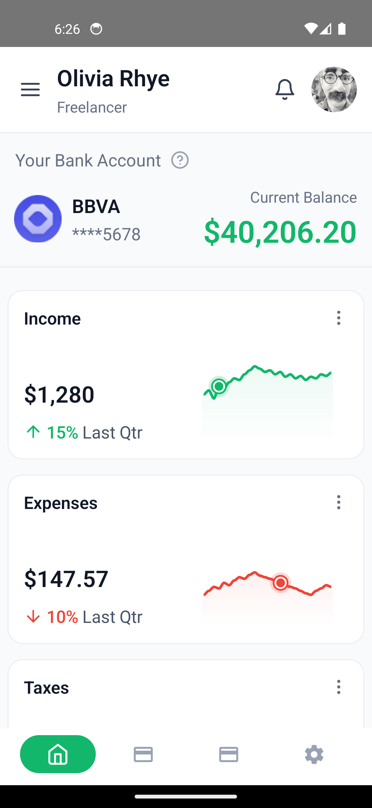

# ILabTask - Financial Dashboard

A modern React Native financial dashboard application featuring interactive charts, real-time data visualization, and intuitive user interface.

## Features

### Interactive Financial Cards
- Dynamic line charts with touch interaction
- Real-time value tracking with animated indicators
- Performance indicators with color-coded status
- Percentage change visualization with directional arrows
- Low performance warnings (below 15%)

### Chart Visualization
- Smooth animated line charts
- Interactive touch points with glowing indicators
- Gradient-filled area charts
- Responsive design with auto-scaling

### UI/UX Features
- Clean, modern interface design
- Animated transitions and interactions
- Color-coded performance indicators
  - Green: Positive growth
  - Red: Negative growth or low performance
- Intuitive touch interactions

## Screenshots

### Dashboard Overview

### Financial Performance

### Interactive Charts

### Detailed Analytics

## Technical Highlights

- Built with React Native and TypeScript
- Reanimated 2 for smooth animations
- SVG-based chart rendering
- Responsive design principles
- Performance-optimized interactions
- Type-safe implementation
- Component-based architecture

## Getting Started

1. Clone the repository
2. Install dependencies: `yarn install`
3. Run the project: `yarn start`

## Dependencies

- React Native
- React Native Reanimated
- React Native SVG
- TypeScript
- React Native Vector Icons 
